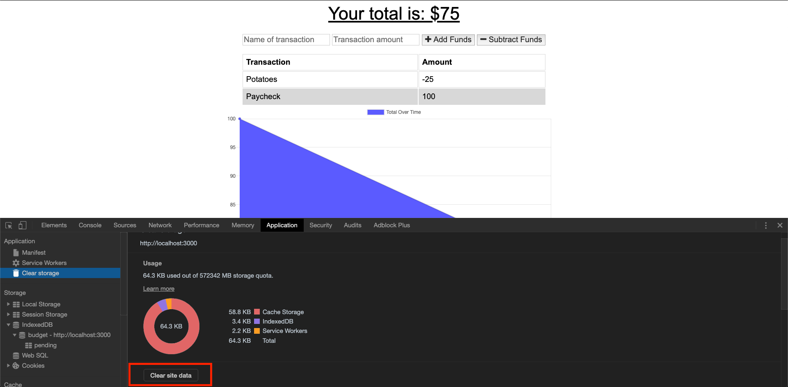

# pwa-example

This is an example Progressive Web Application with detailed steps to make it fully functional. It will not be publicly available after Tuesday, April 28, 2020.

## Setup

1. Copy the files and folders from your Develop folder in the 18-PWA/02-Homework folder. Commit.
2. Install node packages

```js
npm install
```

Commit

3. Test your application
   - Start the server: `node server.js`
   - Visit http://localhost:3000 and confirm that the application works correctly.
   - In Robo 3T, confirm that after adding an entry to your budget, that you now see a budget database and a transactions collection.


## Create the Web Manifest

For the following steps, reference activity 14, 18-PWA/01-Activities/14-Stu_Notetaker_PWA

1. Create a new file in your public folder. Call it `manifest.webmanifest`. Commit.
2. Copy the JSON from activity 14 Solved folder and edit as follows:
   - Modify the name and short_name to match our current app, "Budget App"
   - Modify the icons array to match the two icons provided for you in the Develop folder.
     - HINT: You will need to change the paths for the icons.
3. Link your `manifest.webmanifest` file to your index.html the same way we did in activity 14.

```html
<link rel="manifest" href="manifest.webmanifest" />
```

4. Test your manifest is being read by starting your app and opening up the Application tab in the browser. 

    **HINT: Because we have used PORT 3000 for several of our in class apps, your first step should be to clear all application data.**



If you cleared your site data, simply reload the page and visit the manifest section under the Application tab. You should see a few warnings. 

5. Commit
